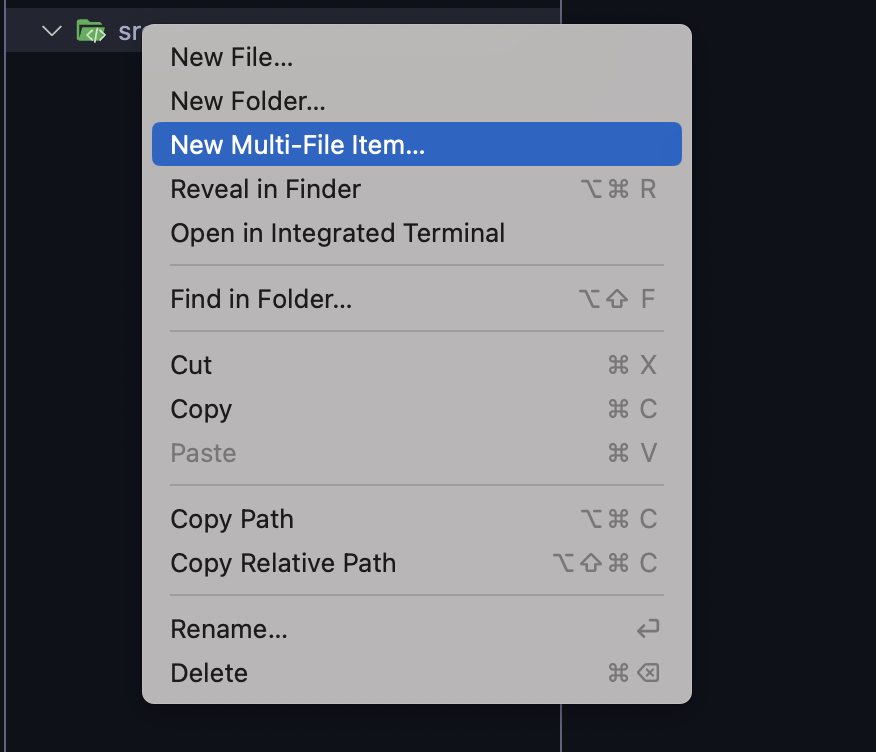
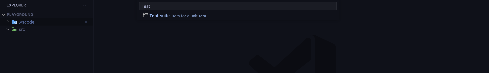
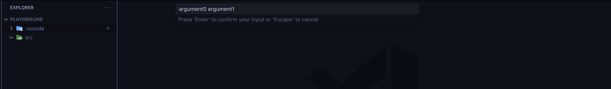
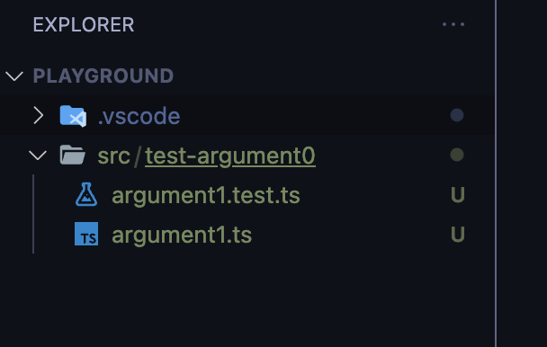

# Add Multi-File

Create custom multi-file items in VS Code, with variable name support!

## Configuration

1. Define the templates in your [`settings.json`](https://code.visualstudio.com/docs/getstarted/settings) file. All templates need a name and their corresponding items, together with an optional description.
   - Variables are supported using `$` followed by a number (so all occurrences of `$N` will be replaced by the `N`th argument you provide during item creation).

```json
"addmultifile.templates": [
    {
        "name": "React Component",
        "description": "Item for a React component and its styles",
        "items": ["$0/$0.tsx", "$0/$0.styled.ts"]
    },
    {
        "name": "Test suite",
        "description": "Item for a unit test",
        "items": ["test-$0/$1.ts", "test-$0/$1.test.ts"]
    }
]
```

2. To create a new multi-file item, right click on the respective folder (just as you would for creating a new file or folder) and select "New Multi-File Item...":

   

3. Select the item you want to create (if you only configured one template, it will be used by default).

   

4. If applicable, input the template's arguments, separated by spaces.

   

5. Done! Your custom multi-file item should be created :)

   

## Author

[Maria José Solano](https://www.maria-sol-os.com/) 🍄

## License

[MIT](https://choosealicense.com/licenses/mit/)
